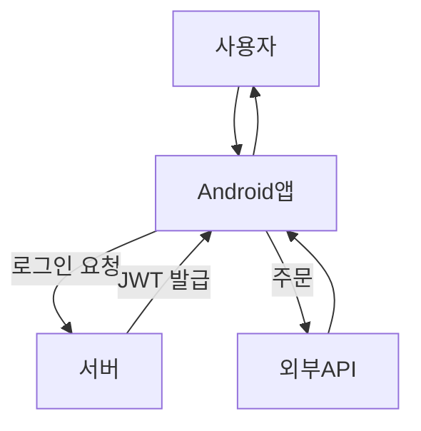

# Secure Order 프로젝트 (개발 진행 중)

**Secure Order**는 레스토랑 주문 및 관리를 위한 Android 애플리케이션과 서버 시스템입니다. 현재 개발 중이며, 사용자 인증 및 보안에 중점을 두고 있습니다. 다양한 외부 API와의 연동으로 실시간 주문 관리 및 안전한 결제 서비스를 제공할 예정입니다.

---

## 🛠️ **주요 기능**

- **🔐 JWT 인증**:  
  사용자가 로그인하면 서버에서 **JWT 토큰**을 발급하고, 이를 통해 이후 모든 요청이 인증됩니다.  
  - **데이터 흐름**:  
    사용자 → Android 앱 → 서버 → JWT 토큰 발급 → 사용자 응답
    
- **🔑 OTP (One-Time Password) 인증**:  
  추가 보안이 필요한 경우 OTP를 이용한 인증을 적용해 사용자의 신원을 확인합니다.  
  - **데이터 흐름**:  
    사용자 → OTP 요청 → 서버 → OTP 발송 → 사용자 입력 → 서버 검증

- **📷 OpenCV 얼굴 인식**:  
  OpenCV 기반의 얼굴 인식을 통해 사용자의 신원을 확인하는 보안 기능을 구현 중입니다.  
  - **데이터 흐름**:  
    사용자 → Android 앱 (얼굴 인식) → 서버 → 얼굴 정보 검증

- **💳 결제 시스템 연동**:  
  KakaoPay와 같은 외부 결제 시스템을 연동하여 안전하고 신속한 결제 경험을 제공합니다.  
  - **데이터 흐름**:  
    사용자 → Android 앱 (결제 요청) → 서버 → KakaoPay API → 결제 완료

- **🍽️ 외부 API를 통한 메뉴 정보 제공**:  
  Yelp, Foursquare, TheMealDB 등의 API와 연동해 사용자가 원하는 레스토랑의 메뉴 정보를 제공합니다.  
  - **데이터 흐름**:  
    사용자 → Android 앱 → 서버 → 외부 API → 메뉴 정보 응답

---

## 🏛 **아키텍처 및 디자인 패턴**

- **MVVM (Model-View-ViewModel)**:  
  Android에서 UI와 비즈니스 로직을 명확하게 분리하여 유지보수성과 확장성을 강화합니다.
  
- **MVC (Model-View-Controller)**:  
  서버 측에서는 MVC 패턴을 적용하여 클라이언트와 서버 간 데이터 흐름을 명확히 하고, 안정적인 구조를 제공합니다.

- **Repository 패턴**:  
  데이터 접근 계층을 비즈니스 로직과 분리하여 코드 가독성 및 유지보수를 용이하게 합니다.

---

## 🔄 **데이터 흐름도**

